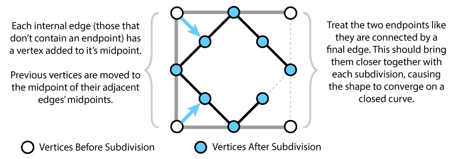
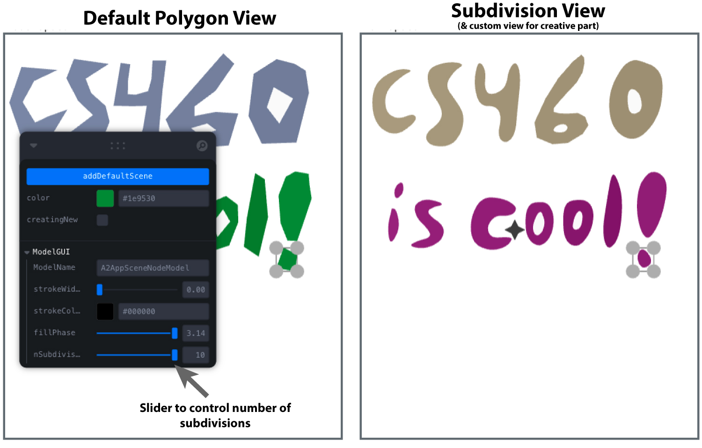

# Assignment 2
Welcome to Assignment 2! In this assignment, we'll be implementing some of the most fundamental (and common) functionality of graphical software. By the time you are done, you will never look at Powerpoint the same way again...

The assignment will have a small 1-week check-in due by **11:59 on September 28** and the final submission due a week later, by **11:59 on October 5**.

Before you read this, make sure to go over [the AniGraph README.md](src/anigraph/README.md) to get some background on how the MVC pattern works in AniGraph applications.

### Setup
Setup is the same as Assignment 1. We will be forking, using TypeScript, and running the app in your web browser.

Reference the guides provided for [Forking](/Forking.md) and [Setup](/Setup.md), and make sure to follow the dependency installation instructions under "[At the start of each assignment](/Setup.md#at-the-start-of-each-assignment)".

## Navigating the Starter Code

Inside the A2 directory you will find all of the files described below. For the most part, each file defines a single class, and closely connected classes are grouped together in subdirectories. Technically, the entry point for our application will be `src/index.tsx`, but in practice, that file just adds some generic template content to the scene and loads an application component specified in `src/App.tsx`. The main code for our application can be found in the `/src/A2` directory, which is where all of your code will go.

Our entry point for A2-specific code will be [A2AppComponent.tsx](src/A2/A2AppComponent.tsx), which loads a custom [React](https://reactjs.org/) Component. You won't need to write any React code as part of the core assignment, so don't worry if you don't know what React is. Below you will find descriptions of all of the main custom classes that make up our app. It will be good to read through the rest of this README to get a high-level picture of how the code works, and there are also comments and examples in the starter code to help with the details.

### `src/A2/`
- [./A2AppComponent.tsx](src/A2/A2AppComponent.tsx): Defines the React component for our application and initializes global AAppState that can be accessed elsewhere. Global app state can be accessed through [`GetAppState()`](src/anigraph/amvc/AAppState.tsx) and [`AAppState.GetAppState()`](src/anigraph/amvc/AAppState.tsx), which will return an instance of [A2AppGlobalState](src/A2/A2AppGlobalState.ts).
- [./A2AppGlobalState.ts](src/A2/A2AppGlobalState.ts) (Extends AniGraph's *AAppState* classes): Defines the above mentioned `A2AppGlobalState` class, which represents stored global state related to our app. In general, it's best to only use global state for logic that needs to be shared across multiple components at once (for example, [a 2D level editor on the left and a 3D viewer on the right](https://www.cs.cornell.edu/courses/cs4620/2021fa/demos/anigraph/basicleveleditor/), or, in the case of A2, a procedural view on the right). The most important example of such data will be our [A2AppSceneModel](src/A2/mvc/scene/A2AppSceneModel.ts), which represents the root of our application's model graph. Keep in mind that the AppState is not a model. If you were to save your work in an application, this should not generally include the AppState. Anything you might want in a save file should be a part of the scene model. (Note: saving is not enabled in the A2 code, but we intend to enable it for A3).

### `src/A2/math/`
- [NodeTransform2D.ts](src/A2/math/NodeTransform2D.ts): Defines a `NodeTransform2D` class, which represents affine transformations with a position, rotation, scale, and anchor offset, as we discussed in class. In this file, you will implement a function that takes an affine input matrix (and optional position constraint) and solves for transform parameters that would lead to that matrix.

### `src/A2/mvc/`
There are three basic types of models in our scene graph. The first represents an entire scene graph, the second represents a single node within a scene graph, and the third represents supplemental information---in our case, the selection of content by a user. Each type of model is associated with its own type of view and controller subclasses, which can be found in corresponding files of the same subdirectory.

#### `src/A2/mvc/scene`
- [A2AppSceneModel.ts](src/A2/mvc/scene/A2AppSceneModel.ts): Defines a model representing our scene. In a basic AniGraph application, the the main function of a scene model is simply to root our hierarchy of node models. However, in a game-like application, the scene model would be a good place to put game data and logic.
- [A2AppSceneController.ts](src/A2/mvc/scene): Defines our scene controller, which is responsible for any interactions that don't belong to individual node models. For example, interactions with the background, like the one triggered by the "creatingNew" switch in A2 that lets a user click on the background to place the vertices of a new polygon.
- [A2AppSceneView/ts](src/A2/mvc/scene/A2AppSceneView.ts): Defines our scene view, which is mostly responsible for holding the [`THREE.Camera`](https://threejs.org/docs/#api/en/cameras/Camera) used to view a scene. In A2 this camera is a simple orthographic camera (we will learn what that means later) and you won't have to mess with it for the assignment. The scene view also holds a background element, which is a transparent element used to intercept user interactions with the background (e.g., deselecting objects or placing new vertices in the scene).

#### `src/A2/mvc/node`
- [A2AppSceneNodeModel.ts](src/A2/mvc/scenenode/A2AppSceneNodeModel.ts): Defines the model for a single node in our scene graph. In our case, the basic model will represent a 2D polygon with the following properties:
  ```typescript 
     // inherited properties:
     @AObjectState name:string;
     @AObjectState verts:VertexArray2D;
     @AObjectState color:Color;
     @AObjectState bounds:BoundingBox2D;
     // subclass properties:
     @AObjectState strokeWidth!:number;
     @AObjectState strokeColor!:Color;
     @AObjectState fillColorPhaseShift!:number;
     @AObjectState nSubdivisions!:number;
  ```
  Here the `@AObjectState` decorator, as in assignment 1, makes a propery part of the model's state, which means that other objects can listen to it for changes. You will also notice a `getModelGUIControlSpec()` method on the node model, which exposes properties for control in the GUI panel when an object is selected. You can follow the format of existing controls, based on the [leva](https://github.com/pmndrs/leva) package, to add additional controls for debugging and/or the creative portion of the assignment. The node model does not need to hold much logic, as its main job is to act as a container for data that other objects will listen to.
- [A2AppSceneNodeView.ts](src/A2/mvc/scenenode/A2AppSceneNodeView.ts): Defines our view for a single node in the scene graph. This connects with our controller `A2AppSceneNodeController` and model
- [A2AppSceneNodeView.ts](src/A2/mvc/scenenode/A2AppSceneNodeView.ts): Defines a basic view for a single scene node model. Right now, this class just subclasses a standard AniGraph class. For your creative submission, you will write your own custom subclass that does something fancy. We are all about being fancy in CS4620/5620, as you already know...
- [A2AppSceneNodeController.ts](src/A2/mvc/scenenode/A2AppSceneNodeController.ts): Defines a controller for scene nodes. Right now, this controller just enables selection, which will let us select the view by clicking on it. Exciting, I know. You could customize a scene node controller to have specialized behavior when the user interacts with a scene node view. For example, you could have it deform around the user's cursor or something...

--------------

## Assignment 2 Core Portion
You will notice that many of the files in the starter code contain only an empty class definition that inherits from some AniGraph object. These files are provided for two purposes: first, as an entry point for possible customization in the creative portion of the assignment; and second, as a jumping off point for anyone curious to explore more of the underlying AniGraph framework. With this in mind, the core portion of this assignment only requires you to edit 3 files: [NodeTransform2D.ts](src/A2/math/NodeTransform2D.ts), [A2AppSelectionController](src/A2/mvc/selection/A2AppSelectionController.ts), and [BasicSubdivision.ts](src/A2/viewcomponent/BasicSubdivision.ts).


### [Part 1: Setting PRSA with a matrix and a position vector](src/A2/math/NodeTransform2D.ts)
Before we walk, we crawl. Before we graphics, we math library. Yes, I'm using "math library" as a verb here---all the cool people do it, and with part 1 of this assignment you will have the opportunity to join our ranks. To accomplish this, you will implement a core method of the `NodeTransform2D` class, which we will use to represent 2D transformations. `NodeTransform2D` objects represent affine transformations using a combination of position, rotation, scale, and anchor shift. You will implement the instance method `setWithMatrix(m:Mat3, position?:Vec2)`, which take a matrix and optional position constraint as input and set the parameters of a `NodeTransform2D` accordingly. You can assume that input matrices will be affine to within some high precision. You should use the [Mat3](src/anigraph/amath/Mat3.ts), [Vec2](src/anigraph/amath/Vec2.ts), and [Vec3](src/anigraph/amath/Vec2.ts) classes from AniGraph when appropriate (this will also make your life easier, trust me...). Check out the comments in [NodeTransform2D.ts](src/A2/math/NodeTransform2D.ts) for more detailed instructions.

### [Part 2: Basic 2D shape manipulation controls](src/A2/mvc/selection/A2AppSelectionController.ts)
Here, we have a controller for user interactions. The starter code implements example callbacks that simply change the shape's position when bounding box corners are dragged, and applies the opposite translation when the `alt` or `shift` keys are pressed.
What we want is the following:
- **Scale** the shape around its anchor when a bounding box corner is dragged
- **Scale uniformly** (the shape's x and y proportions do not change) around its anchor when a bounding box corner is dragged *and* the `shift` key is pressed
- **Rotate** the shape around its anchor when a bounding box corner is dragged *and* the `alt` key is pressed
- **Scale** the shape around the center of its bounding box when a bounding box corner is dragged and **both** the `alt` and `shift` keys are pressed. For this last part in particular you may find the `setWithMatrix` method you implemented in part 1 useful.

The [example callbacks](src/A2/mvc/selection/ExampleHandleCallbacks.ts) show how you might set and use interactions' start and end positions and track events such as keyboard inputs. You should replace the callbacks with your own implementations of the above transformations.

- `dragBBoxCornerStartCallback`: Gets called when a cursor starts to drag a bounding box corner.
- `dragBBoxCornerMoveCallback`: Gets called whenever the cursor is dragging a bounding box corner.
- `dragBBoxCornerEndCallback`: Gets called when the mouse is let go after dragging.

### [Part 3: Basic Subdivision](src/A2/viewcomponent/BasicSubdivision.ts)
For the last part of the core assignment you will add some custom functionality to the scene view shown on the right side of our application. Your task will be to implement a simple type of curve subdivision, which provides a way to generate a smooth curves based on low-resolution input polygons. In the file [src/A2/viewcomponent/BasicSubdivision.ts](src/A2/viewcomponent/BasicSubdivision.ts) you will find a placeholder for the function `getSubdividedVerts`, which takes an input `VertexArray2D` object and returns a new `VertexArray2D` containing the vertices of a new curve subdivided according to the specifications below:



Once implemented, you will be able to use a slider in the selected node GUI to control the number of subdivisions, which will smooth the geometry displayed in the view on the right side of the screen:




You can find additional details in [BasicSubdivision.ts](src/A2/viewcomponent/BasicSubdivision.ts).

To see how the function you wrote is used in practice, check out [A2AppExampleCustomNodeView.ts](src/A2/viewcomponent/A2AppExampleCustomNodeView.ts).


## 1-Week Checkin
It is important that you not put off getting started on this assignment. You will need time to come up with and implement a creative submission. To make sure that everyone is up and running by the 1-week mark, we will have a check-in submission for part 1 of the core assignment due by ***11:59pm, Tuesday 28***. Note that **This is substantially less than half of the total assignment**, so we **strongly** encourage you to have more done by the check-in deadline. With this in mind, there will be no late days for the checkin, so plan accordingly.

------------

## Creative Portion of Assignment 2
In the core part of assignment 2 you wrote code to manipulate transformations with matrices, as well as implement custom interactive controls and views in AniGraph. For the creative part of this assignment we want you build on this to explore more custom features of your own design. Specifically, those of you in CS4620 will create and demo at least one custom view or controller. Those of you in the graduate version of the course will implement at least one or more of each.

Part 3 of the core assignment is a good example of something that can be done through a custom view. This kind of custom modification of input geometry can also be used to create things like fractals and other types of procedural geometry.

The creative part of this assignment is open ended and with AniGraph being largely redesigned this year you will be the first class to explore it in its current form. As such, for the first few days after the assignment is released, the course staff will work on example creative features to help you come up with your own ideas and calibrate expectations. We will demo these example features in lecture and post videos of at least a couple of them to canvas. We encourage you to run your own ideas by us in the first week of the assignment, especially if those ideas may require additional functionality you would like us to add to AniGraph. We *strongly* recommend doing this *before* the 1-week checkin, as we will be freezing both the requirements for the creative part and the addition of any significant functionality to AniGraph for the second week of the assignment. Also, keep in mind that we will not add functionality that might be considered suitable as a creative submission itself---this is to ensure that we do not give away any features that another group could be planning to implement.

AniGraph is a new code base and this is a new assignment, so please let us know if you run into any problems or feel that important information is missing. With that in mind, also remember that we have a working solution to the assignment, so completing it is most certainly possible.

Good luck!

