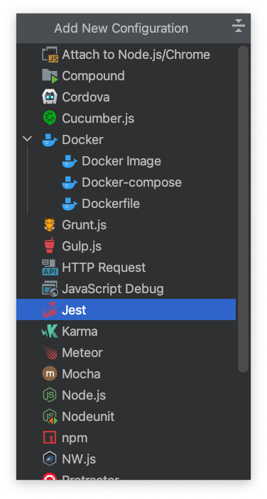
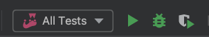
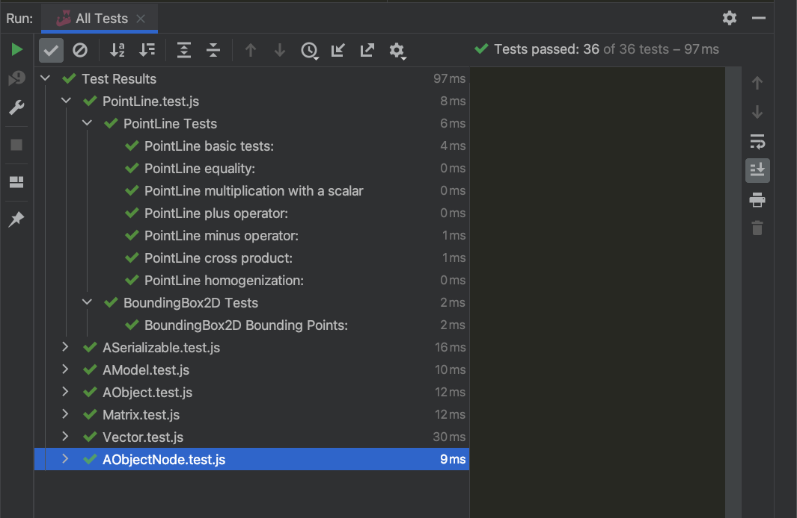
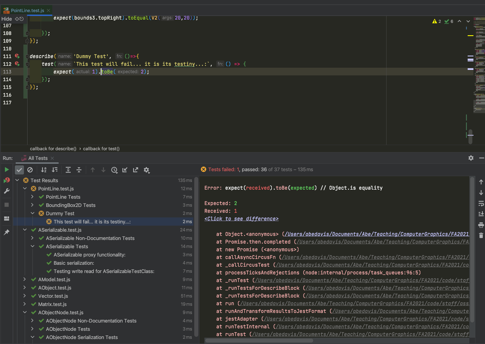

# Testing

We will use [Jest](https://jestjs.io/) for testing. You can find example tests for AniGraph and Assignment 1 in the [src/tests](./src/tests) folder.

### Create a Jest Config
In the Edit Configurations menu, click the `+` sign and select a new Jest Configuration.

The default parameters should work if you set the project up correctly. 

## Running Jest Tests:

You should be able to run the Jest Tests just like any other config. Unlike when you run your app, you can even debug Jest tests directly with this config by clicking the little bug button instead of the play button. Debugging will let you step through any code invoked by your tests with breakpoints, but you may not see the fancy output display unless you run the tests using the play button.

What fancy output discplay, you say? This fancy output display:

When a test fails, it will show up with an X next to it. If you double click on it, you will see the relevant test code, what values were expected for the test, and what values were received. It will look something like this:

