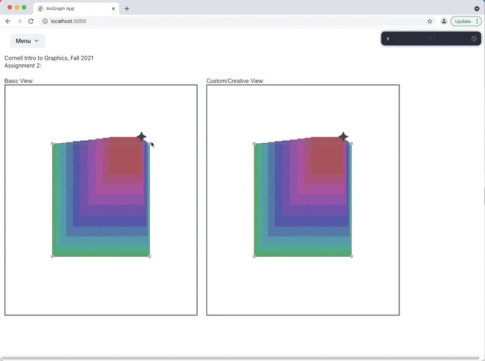
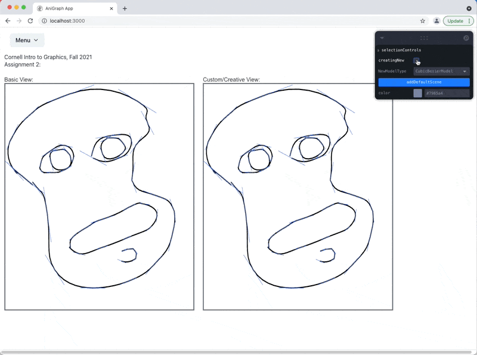

# Creative Submission Examples and Expectations
With open-ended work, some amount of ambiguity in the assignment is necessary. This kind of ambiguity may be more familiar to you in the context of libral arts courses (e.g., write an essay on *x*...) or, in some cases, course projects that take the place of a final exam. It's less common to see this kind of ambiguity as a part of regular assignments in a computer science course---especially one with 150 students in it. To help address any concerns or confusion you might have, below you will find a recap of criteria and examples discussed in class, as well as some additional details about the process we plan to use for grading creative submissions and how we arrived at that process.

### Basic requirements:
CS4620 students should implement at least one of the following. CS5620 should implement at least one of EACH of the following:

- **Custom View Classes**: should moify or replace a model's geometry in some way. Simply changing its color or pose are not enough.
- **Custom Controller Classes**: Should allow for some sort of spatially-sensitive interaction (e.g., when the user clicks and/or drags on a specific element it triggers an animation or response). Simply adding aslider to the GUI panel does NOT count as a custom controller.

You should record a short video demo of your project describing what you implemented and showing off its functionality. Your submission should include:
- A small report on what you did, including who contributed to what pieces of the work. If your video demonstration is well-made and self-contained then this can be as simple as a paragraph descibing the contributions of each member in your group.
- Your video demo of what you built. This should be no longer than 90 seconds. If there are technical details you can't cover in that time, you can include them in your report.
- A Zip of your code. We may run it to test out some features, or look through it to verify certain properties of your implementation. We may also run plagiarism detection/analysis on it if there are any concerns about a possible academic integrity violation.

These are the basic requirements. If you meet them in the most minimal sense (provided you don't just turn in the example code we gave you), you will at least get a passing grade.

**Note that the additional requirement for 5620 does not mean that we expect twice as much from 5620 students. Roughly speaking, our guideline is that an 'A' quality 5620 submission will look something like an 'A' quality 4620 submission plus a 'B-' quality 4620 submission.

### How we will grade submissions
Our approach to grading will balance a few design goals:
- Anyone who meets the requirements should get a passing grade (though, just barely meeting the requirements can mean barely passing...)
- There should be a relatively straightforward way to achieve a grade that puts students on track for a B+/A- in the course, assuming flawless submissions on core parts of assignments.
- Students should be rewarded for creativity and technical merit that goes beyond the examples we provide.
- High quality presentation and explanation of work should be rewarded, but not necessarily required

With these goals in mind, we will evaluate each submission on technical merit, artistic merit and presentation. In practice, artistic merit and presentation overlap a fair bit, and your presentation will need to communicate technical accomplishments well enough for us to understand what they are. So these criteria aren't entirely independent, but we will consider all of them in our evaluation.  

For each creative submission we will show you at least one example that is "on track for a B+/A-" (in A2 it's the fancy spiral example). This example will act as a point of reference for our grading. For each submission we will first check to see that whether all the basic requirements are met, then compare the submission to our reference point along the criteria mentioned above. 

Submissions that go above and beyond the provided example will receive 'bonus points' depending on how impressive the submission is. These points go on a separate column in the spreadsheet where we calculate grades. They will be used to determine who among the A's may get an A+, and whether to bump up the grade of a student who may have tanked part of another assignmet. 

So, if you want a safe path to the minimum amount of work that will guarantee you something in the B to A- range, you can always just implement our reference example (and do well on the core parts of assignments!). If you want a solid A or A+ you may need to do at least a little mode.

### Examples for A2:

#### Basic Pyramid
This examble is approximately in the B- range. It just creates a bunch of instances of the object at different colors and scales relative to the anchor.

----
#### Spiral (slightly fancier pyramid)
Adding a spiral and showing off some cool variability with sliders might bring things more to the B/B+ range:

----
#### Fancier Spiral:
Even more fanciness might be approaching the B+/A- range. Keep in mind that part of this will depend on how you demonstrate and explain it. For example, making some artwork like I showed in class will add to your presentation evaluation.

----
#### Cubic Bezier Splines:
Implementing cubic bezier splines with adjustable control points like shown below would probably put you in the A-/A range:

