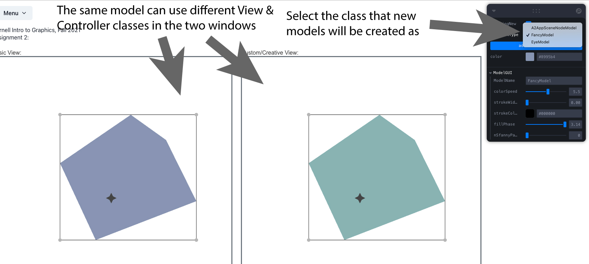
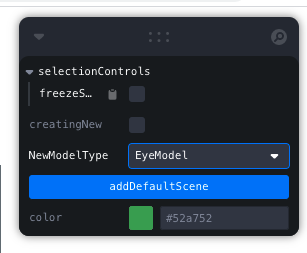

# How to create custom Models, Views, and Controllers

AniGraph is designed to make it easy for you to create and combine different custom models, views, and controllers in the same app. This document will walk you through how to do this.


The simplest way to customize your app might be to modify the class [A2AppExampleCustomNodeView](viewcomponent/A2AppExampleCustomNodeView.ts) that you worked on in the core part of the assignment. However, this will make it hard to explore different creative directions at once. A more organized alternative is to specify new model, view, and controller classes that can be added to your scene. In practice, this works by first creating a new model class, then adding a specification to each scene controller indicating what node controller and view classes it should use for node models of that type. Then the user will be able to select the new model class from a dropdown menu in the application GUI (see image below):



When a new object is created (either with the `addDefaultScene` button or by clicking to lay new vertices with the `creatingNew` check box checked) its model will be created with whatever class is currently specified in the `NewModelType` dropdown.

## Specifying Models, Views, and Controllers
The easiest way to get a sense for how to customize AniGraph is probably to look at the examples provided in [viewcomponent/custom](./viewcomponent/custom).

### Custom Model Classes
A few things to remember when creating your custom model class
- Always remember to decorate new model classes with the `@ASerializable("...")` decorator. The argument to this decorator should be the name of the model class you are creating.
- You will probably want to subclass off of [A2AppSceneNodeModel](./mvc/scenenode/A2AppSceneNodeModel.ts) to make working with typescript easier.

#### Adding a new attribute
If you want to add a new model attribute, you should declare it in your model subclass. Remember that decorating the attribute with `@AObjectState` you will make it available to state listeners. If you want to control attributes in the GUI, you should make them `@AObjectSatate` and add them to the `getModelGUIControlSpec` function, which uses [leva](https://github.com/pmndrs/leva) (you can learn more about GUI options in the [leva](https://github.com/pmndrs/leva) docs). Note that you cannot assign default values to `@AObjectState` in its declaration---you need to set any initialization you want done in the constructor. or use the `!:` syntax to leave an initial value undefined.

Below is the definition of the example [FancyModel](./viewcomponent/custom/fancy/FancyModel.ts) class:
```typescript
@ASerializable("FancyModel")
export class FancyModel extends A2AppSceneNodeModel{
    // we declare the colorSpeed attribute
    @AObjectState colorSpeed:number;
    
    // we initialize colorspeed in our constructor after calling super()
    constructor() {
        super();
        this.colorSpeed=1;
    }

    // We define the gui control specs to let us manipulate colorSpeed with a slider
    getModelGUIControlSpec(){
        const self = this;
        const customSpec = {
            colorSpeed: {
                value: self.colorSpeed,
                min: 0,
                max: 10,
                onChange: (v: number) => {
                    self.colorSpeed = v;
                }
            }
        }
        // return a combination of this control spec and the super class's control spec.
        return {...customSpec, ...super.getModelGUIControlSpec()}
    }

}

```

## Custom View Classes
Custom view classes have access to their corresponding model (via a controller) and are tasked with rendering said model in whatever scene they belong to. The example [./viewcomponent/custom/fancy/FancyView.ts](./viewcomponent/custom/fancy/FancyView.ts) shows how to subscribe to an application timer/clock, which lets you register a callback function that should be executed at frequent regular intervals (ever time the clock updates). You can use such subscriptions to create procedural animations. Note that you could alternatively subscribe to the clock from a model, change some @AObjectState from whatever callback you register with the clock, and then have the view subscribe to the model's state.

The example [./viewcomponent/custom/eyes/EyeView.ts)](./viewcomponent/custom/eyes/EyeView.ts) demonstrates how to add new polygons and lines to a view. The element classes (e.g., [APolygonElement](../anigraph/arender/2d/APolygonElement.ts) are subclasses of [ARenderElement](../anigraph/arender/ARenderElement.ts)), which is a simple helper class that bundles together geometry and material parameters (e.g., color) for [Three.js](https://threejs.org/) objects. You are welcome to use Three.js calls directly if you want to explore that route, or you can use ARenderElement's. The [A2AppExampleCustomNodeView](./viewcomponent/A2AppExampleCustomNodeView.ts) class shows how use procedural modifications of the geometry defined in `model.verts` when rendering a view. Specifically, it uses the subdividion code you wrote in the core part of the assignment to render a smoothed version of the model's original geometry.

## Custom Controller Classes:
You will find two types of customization in [EyeController.ts](./viewcomponent/custom/eyes/EyeController.ts). The first is a drag interaction that triggers when a user clicks and drags on the pupil. This changes the `targetPoint` AObjectState in the corresponding `EyeModel`, which will cause the view to update the iris and pupil to point at the cursor. The second interaction is a click interaction placed on the iris. If you click the colored part of the iris then the eyes will blink. This works by creating a clock subscription that unsubscribes itself after a fixed duration (once the blink animation is complete). The blink duration is AObjectState for the model, and can be adjusted in the GUI controls to create fast regular blinks or slow, meaningful blinks. 

We've added `selectionControls` to the GUI. Right now, the only option in this section (collapsed by default) is `freezeSelection`.



If you check freezeSelection, then regular selection of objects will be frozen. This means that if no objects are selected, then clicking on them will not select them. It also means that if an object is selected, then clicking the background will not deselect it. You can use this option if you don't want default selection behavior to get in the way of whatever custom controls you have in mind. 
